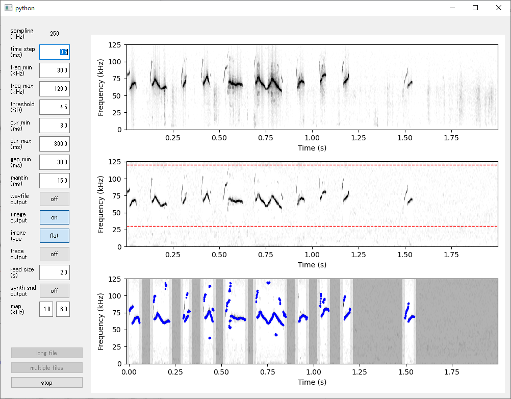

# USVSEG for Python

 &nbsp;&nbsp;

This is a Python implementation of USVSEG. USVSEG is a GUI-based script for robust segmentation of rodents' ultrasonic vocalizations originally written in MATLAB. 

See [the repository of the original MATLAB version](https://github.com/rtachi-lab/usvseg) for general information about USVSEG. 

## Getting Started

To install the software in an Anaconda virtual environment, run the following command:
```
(base) C:\> conda create -n usvseg python=3.7 numpy scipy matplotlib tqdm pyyaml
(base) C:\> conda activate usvseg
(usvseg) C:\> pip install opencv-python
(usvseg) C:\> pip install usvseg
```

Alternatively, you can install the software in a Python venv virtual environment by running the following command:
```
C:\> python -m venv usvseg 
C:\> .\usvseg\scripts\activate.bat 
C:\> pip install numpy scipy matplotlib tqdm pyyaml PyQt5 opencv-python
C:\> pip install usvseg
```

To start the USVSEG GUI, run the following commands in the virtual environment:
```
(usvseg) C:\> usvseg
```

The GUI is compatible to the original USVSEG. You can find the usage of the GUI on [the original site](https://github.com/rtachi-lab/usvseg).

## Contacts
Feel free to open an issue in github for questions and feature requests.

## License
This software is released under the MIT License. See [LICENSE](./LICENSE.txt) for more information. 

This python version of USVSEG is based on [the original MATLAB version](https://github.com/rtachi-lab/usvseg). See [Third Party Notices](./ThirdPartyNotices.txt) for more information. 

## Citation
Original idea and processing procedures of USVSEG have been published in an open-access journal. Please cite this paper when you publish research works with using this software:

> [**USVSEG: A robust method for segmentation of ultrasonic vocalizations in rodents.**](https://journals.plos.org/plosone/article?id=10.1371/journal.pone.0228907),            
> Tachibana RO, Kanno K, Okabe S, Kobayasi KI, Okanoya K      
> *[PloS one 15(2) e0228907](https://journals.plos.org/plosone/article?id=10.1371/journal.pone.0228907)*


